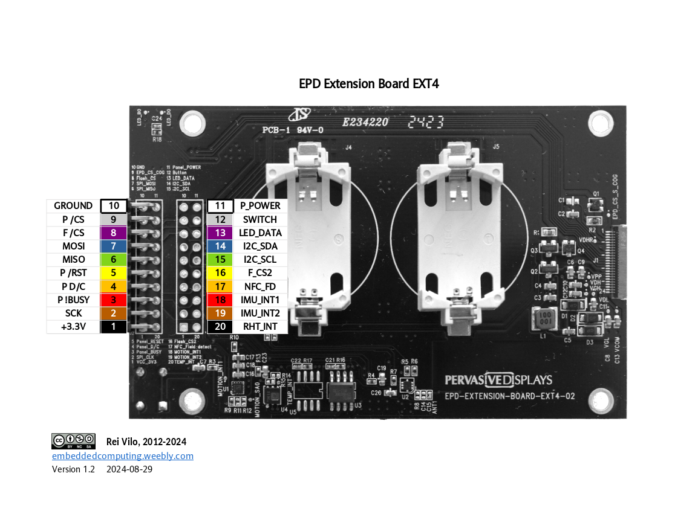
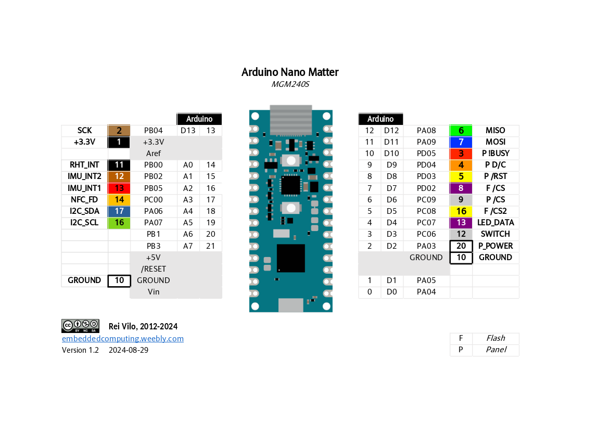
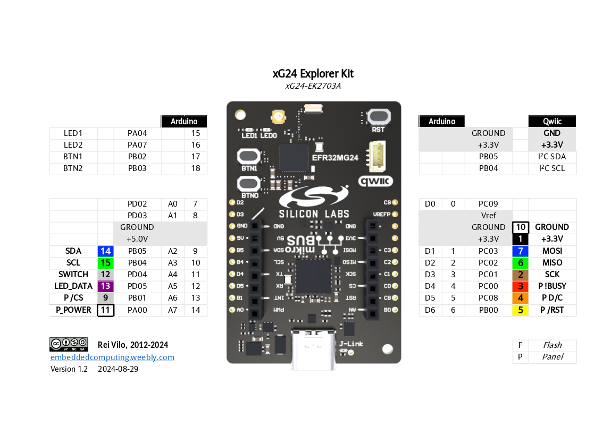
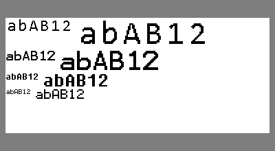
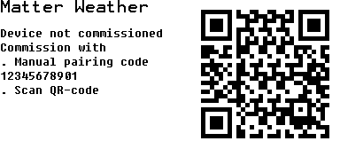
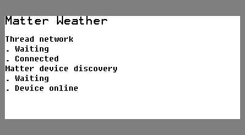
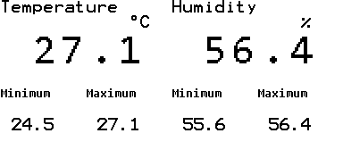
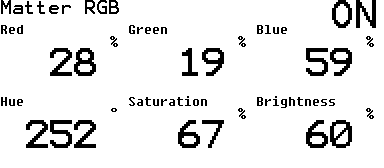
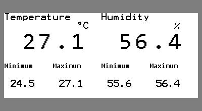
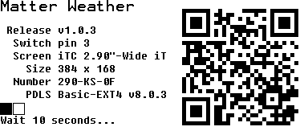

# Pervasive Displays Library Suite - Basic edition for EXT4 and EPDK-Matter

   

  

The Pervasive Displays Library Suite is specifically designed for the [Pervasive Displays](https://www.pervasivedisplays.com) e-paper screens, extension boards and evaluation kits.

The **PDLS\_EXT4\_Basic\_Matter** library supports the screens

* iTC [monochrome screens with wide temperature and embedded fast update](https://www.pervasivedisplays.com/products/?_sft_etc_itc=pu&_sft_temperature_range=m15c-to-p60c) (film `K`), up to 2.9". 

<!-- 
  
 -->

the board

* Pervasive Displays [EPD Extension Kit Gen 4 (EXT4)](https://www.pervasivedisplays.com/product/epd-extension-kit-gen-4-EXT4/) and EXT4-to-Nano adapter boards;

and the kit

* [E-paper Pervasive Displays Kit for Matter (EPDK-Matter)](https://www.pervasivedisplays.com), which includes a Pervasive Displays [EPD Extension Kit Gen 4 (EXT4)](https://www.pervasivedisplays.com/product/epd-extension-kit-gen-3-EXT3/) and a Pervasive Displays EXT4-to-Nano adapter boards, a Pervasive Displays [2.9″ 384x168 E-ink monochrome high-definition](https://www.pervasivedisplays.com/product/2-9-e-ink-displays/) with embedded fast update and wide temperature display, an [Arduino Nano Matter](https://store.arduino.cc/pages/nano-matter) board based on [Silicon Labs MGM240S](https://www.silabs.com/wireless/zigbee/efr32mg24-series-2-modules).

The library has also been tested successfully against the [Silicon Labs EFR32xG24 Explorer Kit](https://www.silabs.com/development-tools/wireless/efr32xg24-explorer-kit) board.

## Features

The Pervasive Displays Library Suite provides a high-level interface to drive the e-paper screens.

* Fast update
* Graphics routines
* Text routines
* Four extended fonts with double-sized variants
* Access to sensors interrupt signals

## Documentation

* [Wiki](https://docs.pervasivedisplays.com/) 
* [User guide](https://pdls.pervasivedisplays.com/userguide/index.html) with commented examples
* [Reference manual](https://rei-vilo.github.io/PDLS_EXT3_Basic_Documentation/index.html) 

## Support

* Please refer to [PDLS_EXT3_Basic_Global](https://github.com/rei-vilo/PDLS_EXT3_Basic_Global/issues) for reporting issues and contributing pull requests.

## Hardware

### EXT4

### Connection to Arduino Nano Matter

<!-- 
### Connection to SiLabs xG24 Explorer Kit

 -->

## Software

### EXT4 sensors examples

Accelerometer-based orientation | Double-sized fonts
--- | ---
 | 

### EXT4 Matter examples

Matter commissioning | Matter connection
--- | ---
 | 

Weather sensor | RGB bulb
--- | ---
 | 

One-button menu | About
--- | ---
 | 

## Examples

### Common examples

* Common_Colours
* Common_Fonts
* Common_Forms
* Common_Orientation
* Common_Persistent
* Common_Text
* Common_WhoAmI

### Fast update examples

* Example_Fast_Line
* Example_Fast_Orientation
* Example_Fast_Speed

### EXT4 sensors examples

* EXT4_WhoAmI
* EXT4_LargeFont
* EXT4_Accelerometer
* EXT4_Weather
* EXT4_WS2813C

### EXT4 Matter examples 
 
* EXT4_Matter_RGB 
* EXT4_Matter_Weather 

## Installation

Software

* [Arduino IDE](https://www.arduino.cc/en/software) or [Arduino CLI](https://arduino.github.io/arduino-cli/)
* [Installing Additional Arduino Libraries](https://www.arduino.cc/en/guide/libraries)

    + Using the Library Manager
    + Importing a `.zip` Library

Hardware

* [Connecting the Pervasive Displays e-Paper EPD Extension Kit Gen 4](https://embeddedcomputing.weebly.com/connecting-the-e-paper-epd-extension-kit-gen-4.html)

## Configuration

Software

* Arduino SDK
* SPI library
* Wire library
* [QRCode library](https://www.arduino.cc/reference/en/libraries/qrcode/) to generate the QR-codes
* [Silicon Labs Arduino Core](https://github.com/siliconlabs/arduino)

Hardware

+ Pervasive Displays EPD Extension Kit Gen 4 (EXT4)

## Licence

**Copyright** &copy; Rei Vilo, 2010-2024

For exclusive use with Pervasive Displays screens

**Licence** [Attribution-ShareAlike 4.0 International (CC BY-SA 4.0)](./LICENCE.md)

**Portions** &copy; Pervasive Displays, Silicon Laboratories Inc., Arduino, 2010-2024

